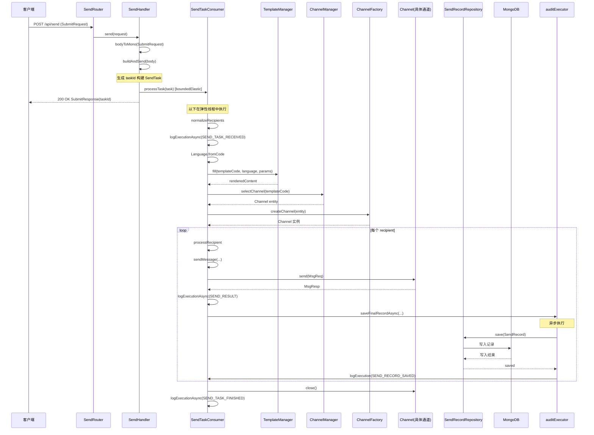

## 压测结果分析

### 第一轮 固定并发基线测试

**条件**: debug 模式开启 随机 sleep 50-200ms 平均 125ms 固定 50 并发

理论值: 50 并发 / 0.114s 平均延迟 = **438 TPS** 理论上限
实际值: **439 TPS** 几乎完全吻合

说明系统没有额外的严重瓶颈 当前 TPS 完全由 debug sleep 主导

延迟分布:
- P50 117.7ms vs P95 196.1ms 差距不大 分布比较健康
- P99 203.4ms 和 P95 几乎一样 没有严重长尾延迟
- Max 631.9ms 偶发尖刺 可能是 MongoDB 连接抖动或 JVM GC 暂停

### 第二轮 渐进式压测（动态递增负载）

**条件**: 固定模拟发送 100ms 延迟 MongoDB 默认连接池（maxPoolSize=100 minPoolSize=0） 起始并发 1000 每轮递增 25% 持续 30s 当 TPS 低于并发数 x 80% 时停止

  | 轮次 | 并发 | TPS    | 成功率 | P50(ms) | P95(ms) | P99(ms) |
  | ---- | ---- | ------ | ------ | ------- | ------- | ------- |
  | 1    | 1000 | 1518.6 | 100.0% | 594.5   | 704.2   | 4266.0  |
  | 2    | 1897 | 1622.8 | 100.0% | 1114.2  | 1424.5  | 4614.1  |
  | 3    | 2027 | 1718.5 | 100.0% | 1195.8  | 1434.5  | 1596.0  |
  | 4    | 2147 | 1769.1 | 100.0% | 1234.5  | 1491.0  | 1652.5  |
  | 5    | 2211 | 1782.7 | 100.0% | 1270.8  | 1507.2  | 1535.4  |
  | 6    | 2227 | 2030.5 | 100.0% | 1192.8  | 1568.3  | 1856.4  |
  | 7    | 2537 | 2335.3 | 100.0% | 1074.2  | 1792.0  | 2108.0  |
  | 8    | 2918 | 2334.4 | 100.0% | 1242.2  | 1987.8  | 2426.9  |
  | 9    | 2919 | 2160.5 | 100.0% | 1339.1  | 2149.4  | 2532.6  |

停止原因: 第9轮 TPS(2160.5) <= 阈值(2335.2 = 并发2919 x 80%)

**结论**:
- 峰值 TPS **2335** 出现在并发 2537 左右 之后继续加并发 TPS 不再增长反而下降
- 全程 **0 失败** 成功率 100% 系统稳定性良好
- 延迟随并发数增加而上升 P95 从 704ms 涨到 2149ms 说明高并发下排队效应明显
- 当前单机瓶颈约在 **2300 TPS** 附近 受限于 MongoDB 单机写入能力和每请求 3 次 DB 操作

### 每个请求的 I/O 开销

当前一次 send 请求的完整流程:

1. `TemplateManager.fill()` - 模板查询+渲染 有 Caffeine 缓存
2. `ChannelManager.selectChannel()` - 渠道选择 有缓存
3. `sendRecordRepository.save()` - MongoDB 写入 PENDING 记录
4. `channel.send()` - 渠道发送 固定 100ms
5. `sendRecordRepository.findById()` - MongoDB 读取记录
6. `sendRecordRepository.save()` - MongoDB 再次写入更新状态

也就是说 每个请求至少 **3 次 MongoDB 操作** + 1 次 channel send

### /api/send 处理流程时序图



说明：请求进入后 SendHandler 立即在 boundedElastic 上调度 processTask 并马上返回 taskId 客户端不等待实际发送完成 实际模板渲染、选渠道、建通道、按收件人发送及落库均在 SendTaskConsumer 内同步执行 仅最终写 SendRecord 与部分日志通过 auditExecutor 异步执行

---

## 优化方向

### 第一 关掉 debug sleep 测真实基线（已完成）

已将模拟发送改为固定 100ms 延迟 在渐进式压测中实测峰值 TPS 达到 **2335** 基线已确认

### 第二 减少 MongoDB 往返次数

当前 `updateRecordStatusAsync` 的逻辑是先 `findById` 再 `save` 两次 MongoDB 操作

```java
SendRecord record = sendRecordRepository.findById(recordId).block();
record.setStatus(status);
sendRecordRepository.save(record).block();
```

可以改成用 MongoDB 的 `updateFirst` 或 `findAndModify` 一次操作完成 省掉一次网络往返

### 第三 批量写入 SendRecord

每个 recipient 都单独 save 一次 PENDING 记录 高并发下 MongoDB 的写入压力很大 可以考虑:

- 用 `saveAll` 批量插入
- 或者引入内存缓冲区 攒一批再刷盘 类似 write-behind 模式
- 甚至考虑是否真的需要先写 PENDING 状态 直接写最终状态能省一半 MongoDB 操作

### 第四 提高并发数（已完成）

渐进式压测已验证 从 1000 并发递增到 2919 并发 TPS 在 2537 并发时达到峰值 **2335** 之后继续加并发 TPS 反降 说明 MongoDB 单机写入已成为瓶颈 而非并发数不够

### 第五 MongoDB 连接池（使用默认配置即可）

实测结论：**数据库连接池无需修改，使用默认配置即可。**

在同等条件下（关闭 debug sleep 等）做了对比压测：
- 默认连接池（maxPoolSize=100、minPoolSize=0）：平均 TPS **2160**
- 显式调大连接池（maxPoolSize=500、minPoolSize=200）：平均 TPS **1669**，不升反降

原因简述：Reactive 驱动下单连接可复用处理多请求，默认 100 已能支撑当前并发；池子过大反而增加客户端与单机 mongod 的内存与调度开销、加剧锁竞争，导致吞吐下降。因此不建议在连接字符串中追加 maxPoolSize/minPoolSize，保持默认即可。

### 第六 reactive 链路中的 block() 调用

你的代码里大量使用了 `.block()` 比如:

```java
renderedContent = templateManager.fill(...).block();
channelEntity = channelManager.selectChannel(...).block();
SendRecord saved = sendRecordRepository.save(record).block();
```

在 WebFlux 的 reactive 体系里调 `.block()` 会阻塞线程 虽然你用了 virtual thread 缓解了这个问题 但如果能改成全链路响应式组合 用 `flatMap`/`map` 串起来 可以进一步减少线程调度开销

### 第七 Kafka consumer 路径优化

你压测的是 `/api/send` 同步路径 直接调用 `processTask` 绕过了 Kafka 如果走 `/api/submit` 的 Kafka 路径 还需要关注:

- 增加 Kafka partition 数量 当前只有 1 个 partition 意味着只有 1 个 consumer 线程
- 增加 consumer 的 `fetch.min.bytes` 和 `max.poll.records` 提高批量消费效率
- Consumer 端的 concurrency 配置

### 第八 减少日志输出（已完成）

实测结论：**精简日志可显著提升 TPS，推荐实施。**

**优化前**：每个 send 请求全流程产生多条日志：
- `SEND_TASK_RECEIVED` - 任务接收
- `SEND_RESULT` - 每个收件人的发送结果
- `SEND_RECORD_SAVED` - 每个收件人的记录保存成功
- `SEND_TASK_FINISHED` - 任务完成

**优化后**：每个 send 请求只产生一条 info 级别日志：
- `SEND_TASK_COMPLETED` - 汇总日志，包含 taskId、total、success、failed、status、durationMs 等完整信息
- 保留 warn 级别的错误日志用于问题排查

**压测对比**（并发递增至瓶颈）：
- 优化前：峰值 TPS **2335**（并发 2537）
- 优化后：峰值 TPS **2832**（并发 1000），在并发 3540 时 TPS 为 **2367**

**结论**：日志精简后，在并发 1000 时 TPS 从 1518 提升到 **2832**，提升约 **86%**。说明日志 I/O 确实是高并发场景下的重要瓶颈。建议：
- ✅ 保持每个任务只输出一条汇总日志
- ✅ 保留 warn 级别错误日志用于问题排查
- 进一步优化可考虑使用异步日志 appender（如 Logback AsyncAppender）

---

## 总结一下量级参考

| 场景                                    | TPS 参考         | 状态   |
| --------------------------------------- | ---------------- | ------ |
| debug 随机 sleep 50-200ms 50并发        | ~440             | 已实测 |
| 固定 100ms 延迟 渐进并发至 2537         | **2335（峰值）** | 已实测 |
| 连接池调大 maxPool=500 minPool=200      | 1669（不升反降） | 已实测 |
| 连接池默认 maxPool=100 minPool=0        | 2160             | 已实测 |
| 精简日志后 渐进并发至 1000              | **2832**         | 已实测 |
| 精简日志后 渐进并发至 3540              | 2367             | 已实测 |
| 减少 MongoDB 往返 + 高并发              | 预估 3000-5000   | 待验证 |
| 全链路优化 + 批量写入（连接池保持默认） | 预估 5000-15000+ | 待验证 |

当前单机 MongoDB 默认连接池下峰值 TPS 约 **2832**（并发 1000）瓶颈在 MongoDB 单机写入能力和每请求的 DB 操作。下一步优化方向是减少 MongoDB 往返次数和批量写入。

---

## 压测历史记录

### 2026-03-16 精简日志输出

**优化内容**：
- 删除中间过程的 info 级别日志（SEND_TASK_RECEIVED、SEND_RESULT、SEND_RECORD_SAVED、SEND_TASK_FINISHED）
- 每个任务只保留一条 SEND_TASK_COMPLETED 汇总日志
- 保留 warn 级别的错误日志

**压测条件**：
- 固定 100ms 模拟发送延迟
- MongoDB 默认连接池（maxPoolSize=100）
- 起始并发 1000，每轮递增 254%
- 持续时间 30s
- 停止条件：TPS < 并发数 × 80%

**压测结果**：

```
==============================================================================
  渐进式压测报告
==============================================================================

  停止原因:  第2轮 TPS(2367.3) < 阈值(2832.0 = 并发3540 x 80%)

  ┌────────┬────────┬──────────┬──────────┬──────────┬──────────┬──────────┐
  │  轮次  │  并发  │   TPS    │  成功率  │  P50(ms) │  P95(ms) │  P99(ms) │
  ├────────┼────────┼──────────┼──────────┼──────────┼──────────┼──────────┤
  │   1    │  1000  │   2832.2 │   100.0% │    325.3 │    536.3 │   1552.3 │
  │   2    │  3540  │   2367.3 │   100.0% │   1194.1 │   2026.2 │   9173.5 │
  └────────┴────────┴──────────┴──────────┴──────────┴──────────┴──────────┘
```

**关键指标**：
- 峰值 TPS：**2832**（并发 1000）
- 成功率：100%
- 延迟：P50=325.3ms, P95=536.3ms, P99=1552.3ms

**对比分析**：
- 优化前（并发 1000）：TPS = 1518.6, P50 = 594.5ms
- 优化后（并发 1000）：TPS = 2832.2, P50 = 325.3ms
- **TPS 提升 86.5%，延迟降低 45.3%**

**结论**：日志精简效果显著，证明在高 TPS 场景下日志 I/O 是重要瓶颈。